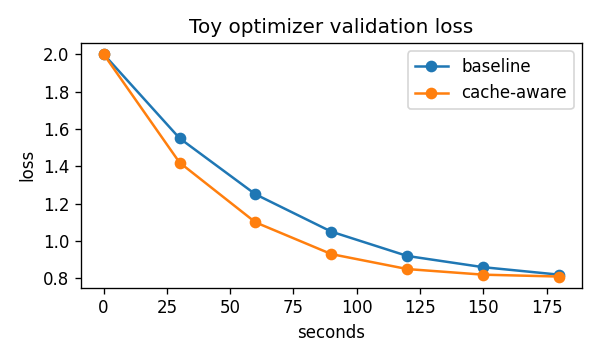

# Tiny Optimizer Claim

The Tiny Optimizer paper claims that cache-aware batching improves toy training throughput by 1.3x while matching the baseline validation curve.


Figure 1. The proposed method reaches the same final loss after 180 seconds.

The benchmark reports 42 tok/s for the baseline and 55 tok/s for the optimized runner.

```bash
git clone https://github.com/example/tiny-optimizer
python bench.py --mode baseline
python bench.py --mode cache-aware
```
